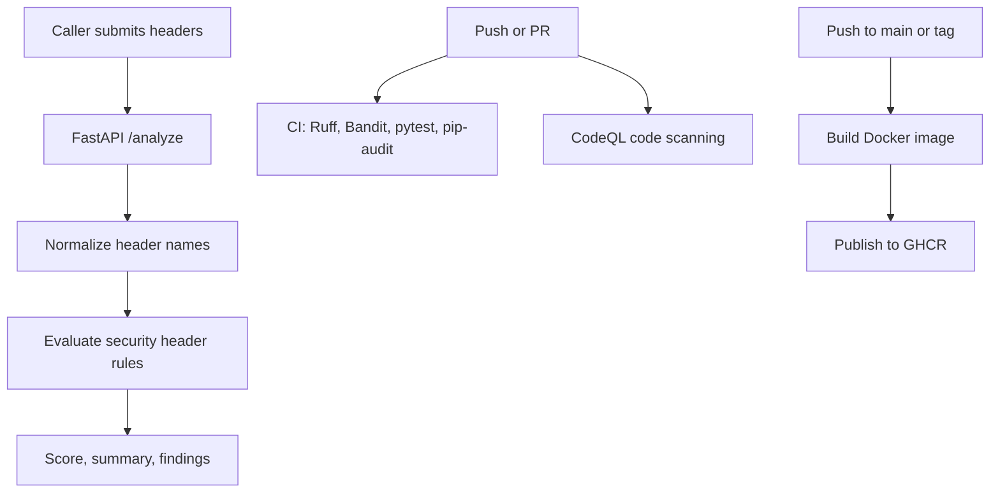

# Security Headers Auditor CI/CD Demo

## Summary

Replace the placeholder FastAPI service with a small cybersecurity-themed API that audits caller-supplied HTTP response headers, then strengthen the existing GitHub Actions pipeline so the repository demonstrates testing, security checks, container build, and real GHCR deployment.

The assignment rewards a clean, running pipeline more than application complexity. The implementation should stay small, readable, and easy for an evaluator to verify in the Actions tab.

---

## Problem Frame

The current repository already has the requested structure and a public GitHub remote, but the application is generic and the CI/CD story is thin. The repo needs a focused security narrative: a Python app that is clearly cybersecurity-related, a pipeline with real successful runs, at least one explicit security step, and a deploy step that publishes a usable artifact.

The Security Headers Auditor is a good fit because it is easy to test, containerize, and explain without introducing databases, authentication, external services, or cloud deployment overhead.

---

## Requirements

**Application behavior**

- R1. The FastAPI app exposes `GET /`, `GET /health`, and `POST /analyze`.
- R2. `POST /analyze` accepts an optional `target` string and a `headers` dictionary supplied by the caller.
- R3. The app does not fetch remote URLs or make outbound network requests during analysis.
- R4. Header matching is case-insensitive.
- R5. The analyzer evaluates at least `Strict-Transport-Security`, `Content-Security-Policy`, `X-Content-Type-Options`, `X-Frame-Options`, `Referrer-Policy`, and `Permissions-Policy`.
- R6. The response includes `target`, a numeric `score` from 0 to 100, summary counts for `passed`, `weak`, and `missing`, and a `findings` list with `header`, `status`, `message`, and `recommendation`.

**Pipeline behavior**

- R7. CI runs on pushes to `main`, pull requests, and manual `workflow_dispatch`.
- R8. CI installs development dependencies and runs linting, Python security linting, tests, and dependency auditing.
- R9. CodeQL runs for Python on pushes, pull requests, scheduled scans, and manual dispatch, and uploads code scanning results.
- R10. The release workflow builds and publishes a Docker image to GitHub Container Registry on pushes to `main`, version tags, and manual dispatch.
- R11. Workflows use least-privilege `GITHUB_TOKEN` permissions and do not require custom repository secrets.

**Documentation and submission**

- R12. The README explains the app, why it avoids URL fetching, local usage, tests, Docker usage, CI/CD workflows, security choices, and GHCR deployment.
- R13. Before submission, the GitHub Actions tab has successful real runs for CI, CodeQL, and container publishing.
- R14. The repository remains public, and the GHCR package is made public if anonymous evaluator pull access is expected.

---

## Key Technical Decisions

- **Caller-supplied headers instead of URL fetching:** The app should analyze a dictionary of headers rather than fetch a target URL. This avoids SSRF risk, keeps tests deterministic, and gives the README a strong security rationale.
- **Scored findings model:** Return a small structured response rather than free-form text. This makes tests straightforward and keeps the API teammate-friendly.
- **Separate runtime and development dependencies:** Keep `requirements.txt` for container/runtime packages and add `requirements-dev.txt` for `pytest`, `httpx`, `ruff`, `bandit`, and `pip-audit`.
- **Security checks in CI, not only separate CodeQL:** CodeQL is valuable, but adding Bandit and `pip-audit` to CI makes the security focus obvious in the main workflow.
- **GHCR as deployment target:** Publishing a container image is a lightweight but real deploy step. It avoids cloud credentials and works with `GITHUB_TOKEN`.
- **Least-privilege workflow permissions:** Each workflow should declare only the permissions it needs: `contents: read` for CI, `security-events: write` for CodeQL, and `packages: write` for GHCR publishing.
- **Branch-and-PR implementation path:** Implement on `codex/security-headers-auditor`, open a PR, let CI run there, then merge to `main` so the release workflow publishes `latest` and `sha-<commit>` images. Direct-to-`main` remains acceptable only if time is too tight.

---

## High-Level Technical Design

---

## Implementation Units

### U1. Security Headers Auditor API

- **Goal:** Replace the generic app with a deterministic API that audits supplied headers.
- **Files:** `app/main.py`, `app/__init__.py`
- **Approach:** Use Pydantic request/response models in `app/main.py`. Normalize headers with lowercase keys. Implement simple rule functions for missing, passed, and weak cases.
- **Rules to include:**
  - `Strict-Transport-Security`: passed when `max-age` is present, weak when present but too low or missing core directives, missing when absent.
  - `Content-Security-Policy`: weak when it contains `unsafe-inline` or `unsafe-eval`; passed when present without obvious weak directives.
  - `X-Content-Type-Options`: passed only for `nosniff`.
  - `X-Frame-Options`: passed for `DENY` or `SAMEORIGIN`.
  - `Referrer-Policy`: passed for recognized restrictive values, weak for permissive values.
  - `Permissions-Policy`: passed when present, weak when empty or overly broad.
- **Test Scenarios:** Covered in `tests/test_main.py` by strong headers, missing headers, lowercase/mixed-case input, and weak CSP.

### U2. Focused Test Suite

- **Goal:** Expand tests from placeholder health checks to behavior that proves the auditor works.
- **Files:** `tests/test_main.py`
- **Test Scenarios:**
  - `GET /health` returns `{"status": "ok"}`.
  - `POST /analyze` with all strong headers returns a high or perfect score and no missing findings.
  - `POST /analyze` with an empty headers dictionary returns missing findings for required headers.
  - Lowercase header names are treated the same as canonical names.
  - A CSP containing `unsafe-inline` is marked `weak`.

### U3. Dependency Layout and Local Developer Commands

- **Goal:** Make local development and CI dependency installation clean.
- **Files:** `requirements.txt`, `requirements-dev.txt`
- **Approach:** Keep only FastAPI and Uvicorn runtime packages in `requirements.txt`; add dev/test/security tools to `requirements-dev.txt`.
- **Test Scenarios:** CI installs `requirements-dev.txt`; Docker build installs only `requirements.txt`.

### U4. Secure Container Defaults

- **Goal:** Keep the container simple while demonstrating basic container hardening.
- **Files:** `Dockerfile`, `.dockerignore`
- **Approach:** Use a slim Python image, install only runtime dependencies, copy app code, create and run as a non-root user, expose port `8000`, and add a healthcheck that calls `/health`.
- **Test Scenarios:** `docker build` succeeds; `docker run -p 8000:8000 secure-cicd-demo` starts; `/health` returns `ok`.

### U5. CI Workflow with Security Gates

- **Goal:** Turn `ci.yml` into the main proof workflow.
- **Files:** `.github/workflows/ci.yml`
- **Approach:** Trigger on `push`, `pull_request`, and `workflow_dispatch`. Use a Python matrix for `3.12` and `3.13`. Install `requirements-dev.txt`. Run `ruff check .`, `bandit -r app -ll`, `pytest -q`, and `pip-audit -r requirements.txt`.
- **Test Scenarios:** Workflow passes on a branch and on `main`; failure in lint, tests, Bandit, or dependency audit fails the job.

### U6. CodeQL Workflow

- **Goal:** Keep CodeQL as the code scanning workflow.
- **Files:** `.github/workflows/codeql.yml`
- **Approach:** Use `github/codeql-action/init` and `github/codeql-action/analyze` for Python. Include scheduled and manual triggers. Use `contents: read` and `security-events: write`.
- **Test Scenarios:** CodeQL workflow completes successfully and publishes code scanning results in GitHub.

### U7. GHCR Release Workflow

- **Goal:** Make deployment real and easy to verify.
- **Files:** `.github/workflows/release-container.yml`
- **Approach:** Trigger on pushes to `main`, `v*` tags, and `workflow_dispatch`. Build the Docker image and push to `ghcr.io/<owner>/<repo>` using `GITHUB_TOKEN`.
- **Tags:** Publish `sha-<commit-sha>` for every run, `latest` for `main`, and a version tag for `v*` refs.
- **Test Scenarios:** Manual dispatch or push to `main` creates a GHCR package with `sha-*` and `latest` tags.

### U8. README Submission Story

- **Goal:** Make the evaluator's review path obvious.
- **Files:** `README.md`
- **Approach:** Rewrite the README around the Security Headers Auditor, local usage, example `curl`, CI/CD workflow explanation, security choices, and GHCR pull instructions.
- **Test Scenarios:** A new reader can run tests, run the app, build the container, and understand how to reproduce the pipeline without asking follow-up questions.

---

## Scope Boundaries

**Must have**

- A small working Python cybersecurity app.
- Real GitHub Actions runs.
- A real deploy artifact in GHCR.
- Security checks in the pipeline.
- Clear README communication.

**Should have**

- Non-root container user.
- Explicit workflow permissions.
- Dependabot for pip and GitHub Actions.
- Manual workflow dispatch for evaluator reproducibility.
- A feature branch and PR before merging to `main`.

**Later**

- Container image scanning with Trivy.
- GitHub Pages UI for pasting headers.
- SARIF upload for Bandit results.

**Non-goals**

- No remote URL fetching.
- No login/auth system.
- No database.
- No cloud provider deployment requiring credentials.
- No complex web frontend.

---

## Risks and Mitigations

- **Risk: CI dependency audit fails because a pinned package receives a new advisory.** Mitigation: use current package versions during implementation and let Dependabot keep updates flowing.
- **Risk: CodeQL action major changes are mis-specified.** Mitigation: validate action references before pushing and prefer stable major versions that exist at implementation time.
- **Risk: GHCR package exists but is private.** Mitigation: note in README and manually set the package public if anonymous evaluator access matters.
- **Risk: Release workflow only runs on tags.** Mitigation: trigger it on pushes to `main` and manual dispatch so the Actions tab shows a real deploy run without requiring a release tag.
- **Risk: The app is too simple to feel cybersecurity-related.** Mitigation: make the endpoint, findings, recommendations, and README clearly about HTTP response header hardening.

---

## Acceptance Examples

- AE1. Given all required strong headers, when the caller posts to `/analyze`, then the API returns a score near 100 with passed findings and no missing findings.
- AE2. Given no headers, when the caller posts to `/analyze`, then the API returns missing findings for all required headers and a low score.
- AE3. Given `content-security-policy: default-src 'self' 'unsafe-inline'`, when the caller posts to `/analyze`, then the CSP finding is `weak`.
- AE4. Given lowercase header names, when the caller posts to `/analyze`, then results match canonical-case behavior.
- AE5. Given a push to `main`, when GitHub Actions runs, then CI, CodeQL, and GHCR publishing produce successful real runs visible in the Actions tab.

---

## Verification Plan

- Run `ruff check .`.
- Run `bandit -r app -ll`.
- Run `pytest -q`.
- Run `pip-audit -r requirements.txt`.
- Build the Docker image with `docker build -t secure-cicd-demo .`.
- Run the container and check `/health`.
- Push to `main` and confirm successful CI, CodeQL, and release-container workflow runs.
- Confirm GHCR has `latest` and `sha-<commit>` tags.
- Confirm repository is public and package visibility matches the submission expectation.

---

## Autoplan Review Notes

- **CEO lens:** The strongest evaluator story is not "complex app"; it is "small security app plus real CI/CD evidence." Keep the scope tight.
- **Engineering lens:** The no-fetch design is the most important security decision in the app itself. It avoids an SSRF footgun and makes deterministic tests easy.
- **DX lens:** The README must be copy-paste friendly. Include local commands, example request, Docker commands, and exact workflow names to inspect.
- **Design lens:** No UI is needed for this assignment. A clear API and README are enough.
